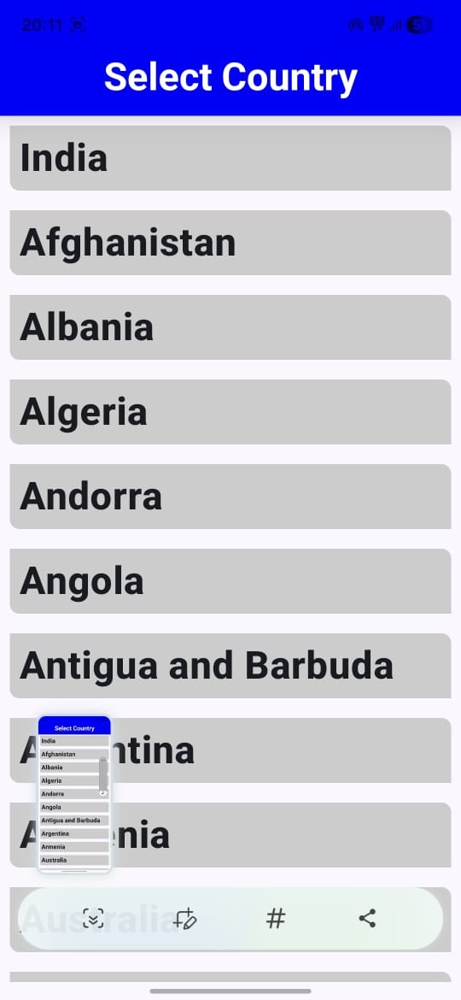

# 📰 NewNews App

NewNews is an Android news application built using **Kotlin** that provides users with the latest news in a clean and simple interface.

The project also demonstrates **modern DevOps practices** by integrating a **CI/CD pipeline using GitHub Actions** to automatically build, sign, version, and release the application.

---

## 🚀 Features

- Latest news browsing
- Clean and simple UI
- Fast and responsive interface
- Automated build and release pipeline
- Automatic versioning with CI/CD

---

## 🛠️ Tech Stack

- **Language:** Kotlin  
- **Platform:** Android  
- **Build Tool:** Gradle  
- **CI/CD:** GitHub Actions  
- **Versioning:** Automated using GitHub workflow run number  
- **Artifacts:** Signed APK and AAB generated automatically

---

## ⚙️ CI/CD Pipeline

This project uses **GitHub Actions** to automate the following:

1. Run unit tests  
2. Build release artifacts (APK & AAB)  
3. Sign Android artifacts securely using repository secrets  
4. Automatically bump application version  
5. Create a GitHub Release with signed artifacts  
6. Update the APK download link automatically

This ensures **continuous integration and automated deployment** for every release.

---

## 📦 Download / Deployment

You can download the latest version of the application from the deployment page:

👉 **[Download Latest APK](https://shashankmahaseth.github.io/NewNewsApp/)**

---

## 📱 App Screenshots

---

## 📌 Project Highlights

- Built fully in **Kotlin**
- **Automated CI/CD pipeline**
- **Secure APK signing using GitHub Secrets**
- **Automated version management**
- **GitHub Release based distribution**

---

## 👨‍💻 Author

**Shashank Mahaseth**

GitHub:  
https://github.com/ShashankMahaseth